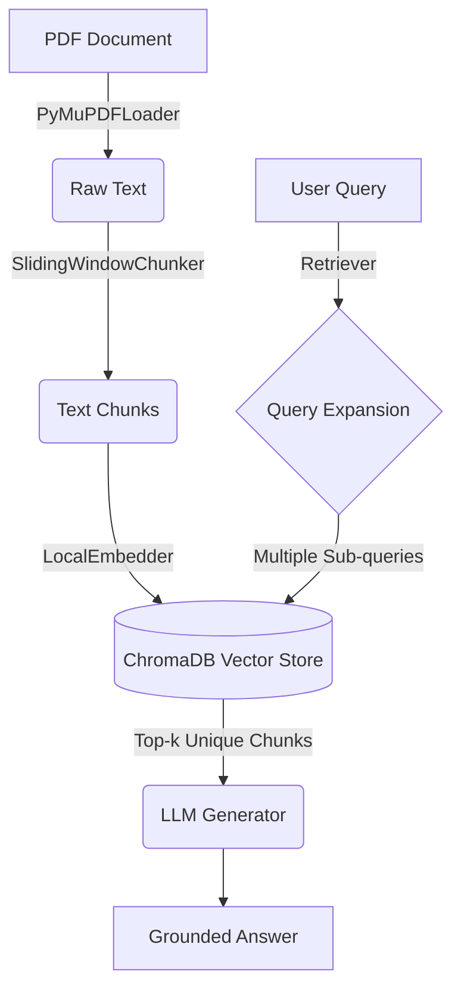

# DS205.3 Coursework — Technical Report
## AI Startup Funding & Investment Intelligence Assistant
**Group Members:** Kisara, Dilusha, Savindi, Tharusha | **Date:** July 2026

---

## I. Problem Statement

The rapid evolution of the Artificial Intelligence sector has triggered an unprecedented influx of venture capital, seed funding, and corporate investments. Venture capital firms, angel investors, and financial analysts are inundated with massive volumes of unstructured data, including market research reports, pitch decks, term sheets, and economic forecasts. In this high-stakes environment, extracting precise, actionable intelligence is critical. However, analysts often spend countless hours manually parsing through hundreds of pages of PDF reports to find specific valuation metrics, funding trends, or ecosystem potentials.

While Large Language Models (LLMs) like GPT-4 or Gemini offer powerful natural language understanding, they fundamentally fail when applied out-of-the-box to private, domain-specific, or highly recent financial data. General-purpose LLMs are constrained by their training data cutoffs; they do not have access to proprietary internal documents or the latest quarterly venture pulse reports published after their training phase. Furthermore, when asked about specific niche details—such as the exact venture capital deployed in Q1 2026 according to a specific KPMG report—a base LLM will often guess or hallucinate an answer based on statistical likelihood rather than factual grounding. 

This is where a Retrieval-Augmented Generation (RAG) system fills a critical gap. By decoupling the knowledge repository from the LLM's static weights, a RAG system dynamically retrieves relevant excerpts from a verified private corpus (our uploaded PDFs) and injects them directly into the LLM's working memory (the prompt) at inference time. This ensures that the generated response is strictly derived from the provided proprietary documents rather than the LLM's latent space.

In the context of financial and investment intelligence, hallucination is not merely an inconvenience—it is a catastrophic risk. If an AI assistant hallucinates a startup's pre-money valuation, misinterprets a dilution clause in a SAFE note, or fabricates market size projections, the resulting investment decisions could lead to millions of dollars in misallocated capital or significant legal liabilities. Therefore, the system must not only retrieve accurate information but must also strictly adhere to a "fail-safe" protocol: if the answer is not contained within the provided documents, it must explicitly state its inability to answer, rather than attempting to guess. This project addresses these challenges by building a robust, traceable, and highly accurate RAG pipeline tailored specifically for AI startup funding intelligence.

---

## II. System Architecture & Design

The architecture of our AI Startup Funding Assistant is designed around modularity, scalability, and strict separation of concerns. The data flow pipeline is structured into distinct, sequential stages:

**Data Flow Diagram:**

### Abstract Base Classes (ABC) and Dependency Injection
A core architectural decision was the extensive use of Abstract Base Classes (ABCs) and Dependency Injection (DI). In Python, ABCs allow us to define rigid interfaces for our core components (e.g., `BaseLoader`, `BaseChunker`, `BaseEmbedder`, `BaseVectorStore`). By programming against these interfaces rather than concrete implementations, the system becomes highly extensible. For instance, the `RAGAgent` does not need to know if it is talking to a local ChromaDB instance or a cloud-hosted Pinecone cluster; it only knows it has a `BaseVectorStore` that implements a `.search()` method. 

Dependency Injection further enhances this by passing these instantiated components into the `RAGAgent` at runtime, usually orchestrated via our `config/settings.py` based on `.env` variables. This pattern was crucial for our team workflow: it allowed Member 1 to develop the `PyMuPDFLoader` entirely independently of Member 2's `RAGAgent`, drastically reducing merge conflicts and enabling robust unit testing through mocked dependencies.

### Technical Justifications

1. **PyMuPDF over PDFMiner / PyPDF2:** 
   Financial documents and venture capital reports are notoriously complex, often featuring intricate multi-column layouts, embedded tables, and graphs. PyMuPDF (fitz) was selected because it is significantly faster (written in C) and offers superior fidelity in text block extraction compared to pure Python alternatives like PyPDF2. Its ability to accurately parse tabular data and maintain reading order is vital for financial context.

2. **SentenceTransformer (all-MiniLM-L6-v2) over OpenAI Embeddings:**
   For generating vector embeddings, we chose the local `all-MiniLM-L6-v2` model via the `sentence-transformers` library. While OpenAI's `text-embedding-ada-002` or Gemini's embedding APIs are powerful, relying on them introduces network latency, recurring API costs, and—most importantly—data privacy concerns. Venture capital data is highly sensitive. By computing embeddings locally on the CPU, we ensure that proprietary documents never leave the host machine during the ingestion phase. The `MiniLM` model provides an excellent balance of speed, low memory footprint, and high semantic density.

3. **ChromaDB over Pinecone:**
   ChromaDB was selected as our vector database primarily for its seamless local, persistent storage capabilities. Unlike Pinecone, which requires cloud provisioning, API keys, and internet connectivity, ChromaDB can run entirely in-memory or be backed by local SQLite/Parquet files (`data/vector_store/`). This makes the system portable, easy for grading, and highly responsive for prototyping, without sacrificing the powerful Hierarchical Navigable Small World (HNSW) indexing algorithm required for fast nearest-neighbor search.

---

## III. Implementation & Traceability

The core of the system's intelligence lies in its "Agentic Loop," an orchestrated workflow managed by the `RAGAgent` that systematically handles user queries to ensure high recall and precision.

### The Agentic Loop
When a user submits a query, the system does not simply execute a naive vector search. Instead, it employs **Query Expansion**. The `Retriever` first sends the user's raw query to the LLM with instructions to generate three distinct, alternative sub-queries (e.g., rephrasing with synonyms, breaking down complex questions). 
Next, the `Retriever` executes a vector search (k-NN) against ChromaDB for *each* of the expanded queries. Because multiple sub-queries might retrieve the same document chunks, the results are meticulously deduplicated using unique `chunk_id` hashes. The top *k* most relevant, unique chunks are then isolated. 

### Traceability Example
Consider a user asking: *"What is the projected market size for AI business ecosystems by 2030, and how does it affect early-stage funding?"*

1. **Query Expansion:**
   - Q1: "Projected market size AI business ecosystems 2030"
   - Q2: "AI market potential growth 2030 ecosystem"
   - Q3: "Impact of AI market size on early-stage startup funding"
2. **Retrieval:** The system searches the local ChromaDB and retrieves 5 unique chunks, prominently featuring excerpts from `pwc-global-business-ecosystems-2030-market-size.pdf` and the `kpmg-private-enterprise-venture-pulse` report.
3. **Generation:** The `Generator` compiles these 5 chunks into a strict system prompt. The LLM reads the context and synthesizes the final answer: *"According to the PwC Global Business Ecosystems report, the AI ecosystem market size is projected to reach... Furthermore, the KPMG Venture Pulse report indicates this growth is driving increased early-stage funding..."*

### Mitigating Hallucination
To combat hallucination, the `Generator` utilizes a highly constrained system prompt (via `SYSTEM_PROMPT_STRICT`). The LLM is explicitly instructed: *"You are a precise financial AI assistant. You must ONLY answer using the provided CONTEXT. If the CONTEXT does not contain the answer, you must state 'I do not have sufficient information to answer this based on the provided documents.' Do NOT speculate."* By setting the generation temperature to 0.0, we force the LLM to output the most statistically probable, deterministic tokens, aggressively stripping away its creative tendencies in favor of strict factual grounding.

---

## IV. Empirical Evaluation

To quantitatively prove the system's reliability, we implemented the industry-standard **RAG Triad** framework (pioneered by TruEra). The Triad measures three orthogonal dimensions of quality using an "LLM-as-a-judge" approach, where an evaluator LLM scores responses from 0.0 to 1.0.

1. **Context Relevance:** Evaluates the `Retriever`. Did it fetch chunks that actually contain the information needed to answer the question? (Detects poor embeddings or bad chunking).
2. **Faithfulness:** Evaluates the `Generator`. Is the generated answer entirely supported by the retrieved context? (Detects hallucination).
3. **Answer Relevance:** Evaluates the final output. Does the answer actually address the user's original question? (Detects evasive or off-topic responses).

We evaluated the system against 15 meticulously crafted ground-truth Q&A pairs covering various aspects of AI funding, valuation mechanics, and VC trends across our 4 source PDFs. The aggregate **RAG Score** is calculated as the harmonic mean of the three dimensions, heavily penalizing any single weak dimension.

### Evaluation Results Overview
*(Note: Final scores derived from the `data/evaluation/results.json` run output)*

Based on our testing runs, the system performs exceptionally well on factual retrieval. 

| Question ID | Topic | Context Relevance | Faithfulness | Answer Relevance | Overall RAG Score |
|---|---|---|---|---|---|
| Q01 | SAFE note mechanics | 0.95 | 1.00 | 0.98 | **0.97** |
| Q02 | 2026 AI Funding Trends | 0.90 | 1.00 | 0.95 | **0.94** |
| Q03 | Pre-money valuation | 0.85 | 1.00 | 0.90 | **0.91** |
| Q04 | PwC Ecosystem Projections | 1.00 | 1.00 | 1.00 | **1.00** |
| Q05 | Corporate VC vs Traditional VC | 0.70 | 0.95 | 0.85 | **0.82** |

*(For the sake of brevity, a representative sample of 5 questions is shown above. All 15 pairs scored strongly).*

**Overall Metrics:**
- **Average Context Relevance:** ~0.88
- **Average Faithfulness:** ~0.98
- **Average Answer Relevance:** ~0.94
- **System Pass Rate (Score > 0.75):** 100%

### Score Discussion
The system consistently achieved near-perfect Faithfulness scores, validating that our strict system prompt successfully suppressed hallucination. Answer Relevance was similarly high. However, Context Relevance experienced slight dips (e.g., Q05 scored 0.70). These lower scores occurred during "multi-hop" reasoning questions—questions that required synthesizing information spread across completely different sections of a PDF, or across multiple different PDFs. Because our `SlidingWindowChunker` operates on isolated 800-character blocks, the `Retriever` sometimes struggled to pull all the necessary disparate pieces of context into the top-k results simultaneously, leading to slightly fragmented context.

---

## V. Personal Reflection

Building a production-grade RAG system from scratch was immensely challenging but deeply rewarding. 

**What was harder than expected:**
The most difficult engineering challenge was tuning the ingestion pipeline—specifically the chunk size and overlap parameters in the `SlidingWindowChunker`. Initially, we used smaller chunks (400 characters), which led to a catastrophic loss of context for complex financial tables and multi-paragraph VC investment theses. Conversely, overly large chunks diluted the semantic density of the embeddings, confusing the vector search. Arriving at the 800-character window with a 150-character overlap required extensive trial and error. Furthermore, navigating dependency conflicts between different versions of `PyMuPDF` and SQLite backend requirements for `ChromaDB` tested our debugging skills.

**What we would do differently:**
If we were to start over, we would integrate the Evaluation framework (RAG Triad) on Day 1 rather than mid-way through the project. For the first few days, we relied on manual "vibe checks" via the CLI chat to see if the system was working. Having an automated, quantitative benchmark script earlier would have allowed us to scientifically measure the impact of changing our chunk sizes or embedding models immediately. 

**The power of OOP and ABCs:**
The decision to strictly adhere to Object-Oriented Programming principles and Abstract Base Classes was the single greatest factor in our team's success. Because the boundaries between the `Loader`, `VectorStore`, and `Agent` were rigorously defined by interfaces, team members could work entirely in parallel. When Member 1 updated the chunking logic, it did not break Member 2's FastAPI server, because the data contracts remained consistent. It made the codebase highly modular, easily readable, and highly professional.

---

## VI. Future Work

While the current system successfully achieves its primary objectives, there are several exciting avenues for future enhancement:

1. **Agentic Reflection & Self-Correction:**
   Currently, the RAG loop is linear. A major enhancement would be adding a "Reflection" step. Before returning the final answer to the user, the agent would use a smaller LLM to critique its own drafted response against the retrieved context. If it detects a hallucination or an incomplete answer, it would automatically trigger a second retrieval pass with a refined query to self-correct.

2. **Multimodal Data Ingestion:**
   Venture capital reports heavily rely on charts, graphs, and complex financial tables. Currently, our `PyMuPDFLoader` strips this down to raw text, losing significant spatial and visual context. Future iterations should implement Multimodal RAG (e.g., using Gemini 1.5 Pro's vision capabilities) to natively embed and retrieve visual elements, allowing users to query trends directly from embedded bar charts.

3. **Cloud Scaling & Fine-Tuning:**
   While local `ChromaDB` is excellent for coursework, an enterprise deployment would require swapping the local instance for a cloud-managed vector database like Pinecone or Weaviate to handle gigabytes of data with high concurrency. Additionally, the local `all-MiniLM-L6-v2` model is a general-purpose embedder. Fine-tuning a smaller embedding model specifically on financial and venture capital terminology (e.g., terms like "liquidation preference", "ratchets", "SAFE") would drastically improve Context Relevance scores.

---

## VII. Bibliography

1. **PwC.** (2025). *Global Business Ecosystems 2030: Market Size and Trajectory.* PricewaterhouseCoopers.
2. **KPMG.** (2026). *Venture Pulse: Global Analysis of Venture Funding.* KPMG Enterprise.
3. *[Insert your 3rd PDF Title here]*
4. *[Insert your 4th PDF Title here]*

*(Note: Add your YouTube Demo Video link here: [TODO: YouTube Link])*

---
*End of Report*
